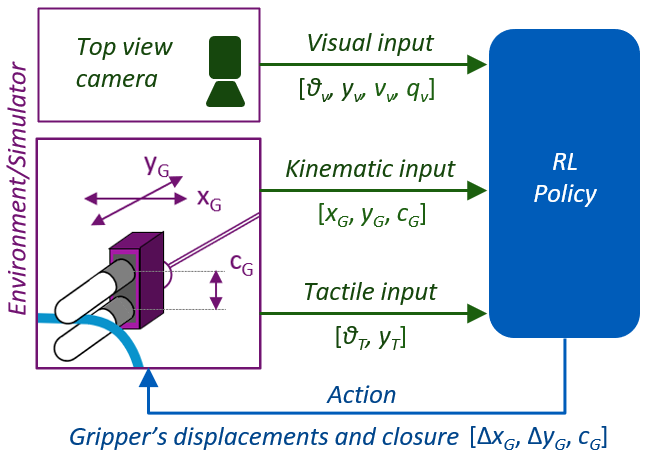
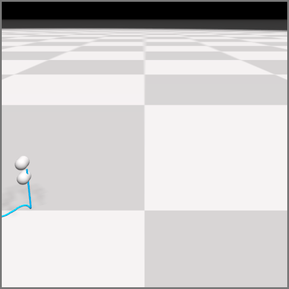

# SoftGym for DLO following
This repository contains a new benchmark environment based on the rope flatten <a href="https://sites.google.com/view/softgym/home">SoftGym</a> environment.
An adapted Soft Actor-Critic algorithm benchmark for this environment can be found in [SoftAgent DLO following](https://github.com/lpecyna/Softagent_rope_following).

The original <a href="https://sites.google.com/view/softgym/home">SoftGym</a> is a set of benchmark environments for deformable object manipulation including tasks involving fluid, cloth and rope. It is built on top of the Nvidia FleX simulator and has standard Gym API for interaction with RL agents. A number of RL algorithms benchmarked on SoftGym can be found in <a href="https://github.com/Xingyu-Lin/softagent">SoftAgent</a>

## Installation Using Docker
If you are using Ubuntu 16.04 LTS and CUDA 9.2, you can follow the steps in the next section on this page for compilation. For other versions of Ubuntu or CUDA, SoftGym authors provided the pre-built Docker image and Dockerfile for running SoftGym. Please refer to the [Docker](docker/docker.md) page.

Additional information about installation using Docker can be found on Daniel Seita blog: https://danieltakeshi.github.io/2021/02/20/softgym/.

## Instructions for Installation 
1. This codebase is tested with Ubuntu 16.04 LTS, CUDA 9.2 and Nvidia driver version 440.64. Other versions might work but are not guaranteed, especially with a different driver version. Please use our docker for other versions.

The following command will install some necessary dependencies.
```
sudo apt-get install build-essential libgl1-mesa-dev freeglut3-dev libglfw3 libgles2-mesa-dev
```

2. Create conda environment
Create a conda environment and activate it: `conda env create -f environment.yml`

3. Compile PyFleX: Go to the root folder of softgym and run `. ./prepare_1.0.sh`. After that, compile PyFleX with CMake & Pybind11 by running `. ./compile_1.0.sh` Please see the example test scripts and the bottom of `bindings/pyflex.cpp` for available APIs.
 
## The task


The agent is supposed to slide along the rope - using an appropriate grasping force - to its tail end. The beginning of the rope is firmly attached to a point in space in the simulator.
The goal behaviour is achieved when the gripper follows the rope and holds it close to its final end.

## Experiments
The environment presented in this repository allowed us to test the Reinforcement Learning agent using different sensing modalities and investigate how its behaviour
can be boosted using visual-tactile fusion. We also performed some ablation studies to assess the influence of particular input signal.



More details about experiments performed can be found in ([paper - TBD]()).


Depending on the type of inputs and training length the observed outcome behaviour can be categorised as follows:

| Image                                     | Name                                                               | Description                                                                                                |
|-------------------------------------------|:-------------------------------------------------------------------|:-----------------------------------------------------------------------------------------------------------|
|      | Hold the end                                                       | The gripper follows the DLO till its end, it stays there and holds the object. This is the goal behaviour. |
|         | Stop before                                                        | The gripper did not reach close to the end but it did not drop the ject                                    |
|  | Reach end but drop                                                 | The gripper reached the end of the DLO but failed to keep the object                                       |
|         | Drop before                                                        | The gripper dropped the DLO earlier, without reaching its end.                                             |

   
To have a quick view of a task (with random actions), run the following commands:

- RopeFollow: `python examples/random_env.py --env_name RopeFollow`

To have a quick check the behaviour and manually manipulate the agent's behaviour run in python interpreter:
- RopeFollow:  `examples/random_env_manual_check.py`

Turn on the `--headless` option if you are running on a cluster machine that does not have a display environment. Otherwise you will get segmentation issues. Please refer to `softgym/registered_env.py` for the default parameters and source code files for each of these environments.

## Cite
If you find this codebase useful in your research, please consider citing:
```
TBD
```

## References
- NVIDIA FleX - 1.2.0: https://github.com/NVIDIAGameWorks/FleX
- Python interface builds on top of PyFleX: https://github.com/YunzhuLi/PyFleX
- SoftGym repository: https://github.com/Xingyu-Lin/softgym
- If you run into problems setting up SoftGym, Daniel Seita wrote a nice blog that may help you get started on SoftGym: https://danieltakeshi.github.io/2021/02/20/softgym/
